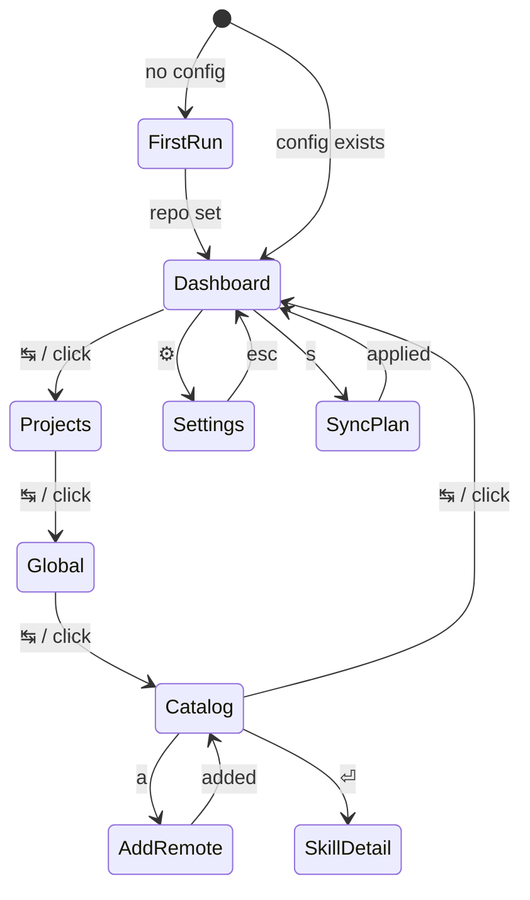

# TUI — screens and interaction design

> **Part built, part sketch.** **Built and current:** the first-run screen, the tab shell + settings gear, the **Global** and **Catalog** tabs (their mockups below match the code — both the same master-detail widget), and the first write path — the **sync modal** (Catalog → global) and the **remove-confirm modal** (Global). **Still design intent:** the Dashboard and Projects mockups, the skill-detail / add-remote / sync-plan overlays, and the full sync-status vocabulary — those are aspirational until the rest of the sync engine exists. The model these screens sit on is in [overview.md](overview.md); the sync/remove flows in [sync-a-skill-to-global.md](../workflows/sync-a-skill-to-global.md) and [remove-a-global-skill.md](../workflows/remove-a-global-skill.md); stack rules in [ratatui-tui-stack.md](../guides/ratatui-tui-stack.md); the repo the Catalog reads in [loom-skills-repo-layout.md](../guides/loom-skills-repo-layout.md).

## Assumptions

- **Large screen.** The layout assumes a roomy terminal (≥ ~100 cols). A tab bar, a persistent left nav, and multi-pane content are the default. Narrow-terminal behavior (collapse the left nav, stack the summary cards) is a later concern — see [Open questions](#open-questions).
- **Mouse and keyboard, first-class.** Like herdr, every navigation affordance is clickable *and* keyable. See [Interaction](#interaction-mouse--keyboard).

## Chrome: the persistent frame

Every screen shares one frame: a **top tab bar** (major areas) with a **settings gear top-right**, a **left nav** scoped to the active tab, the **content view**, and a **footer** of context keys + mouse hints.

```text
┌ TAB BAR: skilloom · [active tab] other tabs ....................... ⚙ ┐
│ LEFT NAV        │  CONTENT — the active tab's page                     │
│ (tab-specific)  │                                                      │
│                 │                                                      │
├ FOOTER: context keys + mouse hints ───────────────────────────────────┤
└───────────────────────────────────────────────────────────────────────┘
```

The four tabs map onto the hub-and-spoke model: **Catalog** is the library (the loom-skills repo), **Global** and **Projects** are the two places skills deploy to, and **Dashboard** is the view across all of it.

| Tab | What it is | Left nav |
|-----|-----------|----------|
| **Dashboard** | Overview: search + summary (updates available, sync roll-up, recent activity) | — (full-width) |
| **Projects** | Your tracked projects; pick one to manage its skills | project list |
| **Global** | Installed skills, grouped by agent dir — browse (read-only today) | location groups |
| **Catalog** | The loom-skills library (`personal/` + `vendor/`) — browse (read-only today); add remote / deploy later | `personal` / `vendor` groups |
| **⚙ Settings** | Repo location, agent targets, sync options, about — reached via the gear (top-right) or `,` | settings sections |

## Legend

Code blocks are monochrome, so state is carried by glyphs; each maps to a themed color ([ADR-0002](../adrs/0002-rust-and-ratatui-for-the-tui.md)).

**Sync status** (a skill, or a skill at one destination):

| Glyph | Meaning | Color |
|-------|---------|-------|
| `●` | in sync | green |
| `↑` | your side is newer — repo/local ahead of a destination (or on-disk, not yet in repo) | yellow |
| `▲` | a source is newer — behind upstream/repo | blue |
| `↕` | differs on both sides (later: opens a diff) | magenta |
| `○` | available, not deployed to this destination | dim |
| `✗` | source gone / broken | red |

**Origin:** `personal` · `vendor:<src>`. **Deployed to:** `G` = global · project names · `—` = nowhere. **Selection:** `▸` marks the focused row/nav item. **Symlink:** a trailing `@` marks a skill that's a symlink; the detail shows its real target.

> **Implemented today:** both master-detail tabs use only `●`/`○`, as a folder-**name match** (a placeholder). Global: `●` tracked in the repo / `○` not. Catalog: `●` installed in a global dir / `○` not — the mirror check. The fuller vocabulary above (`↑`/`▲`/`↕`, "deployed to", origins) arrives with the sync ledger.

## Navigation

Tabs cycle with `↹` (or jump with `1`–`4`, or click). Settings (`⚙`/`,`), skill detail (`⏎`), and the sync plan (`s`) open as overlays over any tab and `esc` back.



## First run

No config yet → point skilloom at the loom-skills repo, saved to `~/.config/skilloom/config.toml`. No tabs until this is done.

```text
┌ skilloom · first run ──────────────────────────────────┐
│                                                        │
│  Point skilloom at your skills repo (loom-skills).     │
│                                                        │
│  Repo path or git URL                                  │
│  ┌──────────────────────────────────────────────────┐ │
│  │ ~/projects/loom-skills                           │ │
│  └──────────────────────────────────────────────────┘ │
│                                                        │
│  Saved to ~/.config/skilloom/config.toml               │
│              ⏎ continue        esc quit                │
└────────────────────────────────────────────────────────┘
```

## Dashboard tab

Search + summary cards + recent activity. Full-width (no left nav).

```text
┌ skilloom ─ [ Dashboard ]  Projects   Global   Catalog ──────────────────  ⚙ ┐
│  ⌕ ┌─────────────────────────────────────────────────────────────────────┐ │
│    │ search skills…                                                      │ │
│    └─────────────────────────────────────────────────────────────────────┘ │
│  ┌ Overview ──────────────┐  ┌ Updates available · 3 ─────────────────────┐│
│  │  24 skills             │  │ ▲ rust-testing   vendor:x/skills      3 ↑   ││
│  │  18 ● in sync          │  │ ▲ changelog      vendor:y/kit         1 ↑   ││
│  │   4 ▲ need sync        │  │ ▲ pdf-filling    vendor:anthropic     2 ↑   ││
│  │   2 ✗ issues           │  │       [ sync all ]        [ review ]        ││
│  │  3 projects · global   │  └─────────────────────────────────────────────┘│
│  └────────────────────────┘                                                 │
│  ┌ Recent activity ────────────────────────────────────────────────────────┐│
│  │ 2d  synced rust-testing → global                                         ││
│  │ 2d  imported pr-review from ~/.claude → personal/                        ││
│  │ 5d  added vendor:anthropic/skills (pdf-filling, slack-gif)               ││
│  └──────────────────────────────────────────────────────────────────────────┘│
├ ↹ tab · 1-4 jump   / search   s sync all   , settings   click   ? · q ───────┤
└────────────────────────────────────────────────────────────────────────────────┘
```

- **Search** finds skills across the library and destinations; `/` focuses it.
- **Updates available** = vendored skills whose remote is newer; `[ sync all ]` opens the sync plan pre-filled.
- **Recent activity** is the ledger's log — syncs, imports, adds.

## Projects tab

Left nav = tracked projects; content = the selected project's skills and actions.

```text
┌ skilloom ─ Dashboard   [ Projects ]   Global   Catalog ─────────────────  ⚙ ┐
│ PROJECTS          │ web-app · ~/projects/web-app                            │
│ ▸ web-app         │ ────────────────────────────────────────────────────── │
│   api             │ ST  SKILL           SOURCE             ACTION           │
│   docs-site       │ ●   commit-helper   repo:personal      in sync          │
│                   │ ▲   changelog       repo:vendor y/kit   [ sync ]         │
│ + add project     │ ↑   deploy-notes    project-only        [ push to repo ]│
│                   │ ○   rust-testing    repo (available)    [ install ]      │
│                   │                                                         │
│                   │ [ sync project ]    [ open folder ]                     │
├ ↹ tab   ↑↓ nav   ⏎ detail   space select   s sync   click   , settings  ? q ┤
└────────────────────────────────────────────────────────────────────────────────┘
```

`deploy-notes` lives only in the project (`↑`, "project-only") — curation guardrail: it stays put unless you explicitly `[ push to repo ]`. `rust-testing` is in the repo but not installed here → `[ install ]`.

## Global tab — **built, current**

Master-detail. **Left nav:** installed skills grouped by agent dir (`~/.claude/skills`, `~/.agents/skills`, `~/.codex/skills`, `~/.cursor/skills`; empty dirs show `(none)`, missing dirs are skipped). Each skill is a **two-line card** — name on top with the symlink `@` floated right, the `SKILL.md` description below it (grayed, truncated). **Right pane:** a metadata **header card** (location, `links to <real path>` for symlinks, synced status) over a **details box** reserved for the `SKILL.md` body, with a **`[ Remove ]`** action button top-right. The nav **scrolls** (scrollbar on overflow) to keep the selection visible. Select with `↑↓`/`j`/`k`, a click, or the scroll wheel; **`x`** (or the button) opens the remove-confirm modal.

```text
┌ skilloom ─ Dashboard  Projects  [ Global ]  Catalog ─────────────────────  ⚙ ┐
│ Global ──────────────────────┐┌ herdr ─────────────────────────────────────┐│
│ ~/.claude/skills             ││ location  ~/.claude/skills                  ││
│ ▸ herdr                   @  ││ links to  ~/.agents/skills/herdr  (symlink) ││
│   Control herdr from insid…  ││ status    ○ not synced (not in repo)        ││
│   okq-explore             @  │└─────────────────────────────────────────────┘│
│   Search and navigate an O…  │┌ details ────────────────────────────────────┐│
│ ~/.agents/skills             ││ SKILL.md contents will show here.           ││
│   herdr                      ││                                             ││
│ ~/.codex/skills              ││                                             ││
│   (none)                     ││                                             ││
├ ↑↓ select · ↹ tab · f refresh · , settings · q quit ─────────────────────────┤
└────────────────────────────────────────────────────────────────────────────────┘
```

Note: `herdr` appears under both `~/.claude` (a symlink, `@`) and `~/.agents` (the real dir, no `@`) — the symlink flag makes the duplication legible. Its `links to` line points at the real content.

## Catalog tab — **built, current**

The loom-skills library, as the **same master-detail widget as Global** (shared
code — see [ratatui-tui-stack.md](../guides/ratatui-tui-stack.md)). **Left nav:**
the repo's skills grouped into `personal` and `vendor` (both always shown; an
empty group reads `(none)`), each a two-line card (name + `SKILL.md` description).
**Right pane:** a metadata **header card** (location = `personal`/`vendor`, and an
`installed globally` status — the mirror of Global's "in repo" check) over the
**details box** reserved for the `SKILL.md` body, with a **`[ Sync → ]`** action
button top-right. Same nav: `↑↓`/`j`/`k`, click, or scroll wheel; the list scrolls
to keep the selection visible. **`s`** (or the button) opens the **sync modal**
(below); `+ add remote skill` still comes with the vendor write path. The repo
layout it reads is documented in
[loom-skills-repo-layout.md](../guides/loom-skills-repo-layout.md).

```text
┌ skilloom ─ Dashboard   Projects   Global   [ Catalog ] ─────────────────  ⚙ ┐
│ Catalog ─────────────────────┐┌ sample-skill ──────────────────────────────┐│
│ personal                     ││ location  personal                          ││
│ ▸ sample-skill               ││ status    ○ not installed                   ││
│   A tiny sample skill so sk…  │└─────────────────────────────────────────────┘│
│ vendor                       │┌ details ────────────────────────────────────┐│
│   (none)                     ││ SKILL.md contents will show here.           ││
│                              ││                                             ││
├ ↑↓ select · ↹ tab · f refresh · , settings · q quit ─────────────────────────┤
└────────────────────────────────────────────────────────────────────────────────┘
```

The fuller design — category nav (`All`/`Personal`/`Vendor`), by-source groups, a
**Deployed to** column, `+ add remote skill`, and inline `[ fetch ]`/`[ deploy ]`
actions — is deferred to the sync engine and ledger; the read-only master-detail
above is what ships today.

## Settings (⚙)

Reached via the top-right gear or `,`. Left nav = settings sections; `esc` returns to the last tab.

```text
┌ skilloom ─ Dashboard   Projects   Global   Catalog ─────────────────────  [⚙]┐
│ SETTINGS          │ skilloom settings                                       │
│ ▸ Repo            │ ────────────────────────────────────────────────────── │
│   Agent targets   │ loom-skills repo                                        │
│   Sync            │   path    ~/projects/loom-skills                        │
│   About           │   remote  git@github.com:mikevalstar/loom-skills.git    │
│                   │                                                         │
│                   │ locations                                              │
│                   │   config  ~/.config/skilloom/config.toml                │
│                   │   state   ~/.local/state/skilloom/                      │
│                   │                                                         │
│                   │ [ change repo ]   [ open config ]                       │
├ esc close settings   ↑↓ nav   ⏎ edit   click   ? help   q quit ─────────────┤
└────────────────────────────────────────────────────────────────────────────────┘
```

- **Agent targets** — which agent dirs skilloom manages (`~/.claude`, `~/.agents`, `~/.cursor`, …) and how the global side fans out (one canonical `~/.agents/skills` + symlinks vs. a copy into each — the open mechanism question from [overview.md](overview.md)).
- **Sync** — defaults like confirm-before-apply, auto-fetch on open.

## Overlays

Reachable from any tab; float centered over the frame. Two are **built**; the
rest are design intent.

### Sync modal — **built** (`s` on Catalog)

Pick a destination and which agent dirs to symlink into, then Sync. Global works;
Project is a stub. Interactive rows form one focus ring (keyboard `↑↓` + `space`/`⏎`,
or click); the Sync button is focused on open, so `s` then `⏎` syncs with defaults.

```text
┌ sync skill ──────────────────────────────────────────────────┐
│ Sync 'sample-skill'  (personal)                              │
│                                                              │
│ destination                                                  │
│   (•) Global                                                 │
│   ( ) Project — coming soon                                  │
│                                                              │
│ link into                                                    │
│   [x] ~/.claude/skills                                        │
│   [x] ~/.codex/skills                                         │
│                                                              │
│   [ Sync ]                                                   │
│   [ Cancel ]                                                 │
└──────────────────────────────────────────────────────────────┘
```

### Remove-confirm modal — **built** (`x` on Global)

The permanence line adapts: green when the skill is in your Catalog (re-syncable),
yellow for a not-in-Catalog symlink (only the link goes), red for a not-in-Catalog
real dir (permanent). Focus defaults to Cancel.

```text
┌ remove skill ────────────────────────────────────────────────┐
│ Remove 'herdr'?                                              │
│                                                              │
│ from  ~/.claude/skills                                       │
│ symlink → ~/.agents/skills/herdr (only the link is removed)  │
│                                                              │
│ Not in your Catalog — but this only unlinks; the target is … │
│                                                              │
│   [ Remove ]                                                 │
│   [ Cancel ]                                                 │
└──────────────────────────────────────────────────────────────┘
```

### Design intent (not built)

**Skill detail** (`⏎` on a skill) — the per-destination truth for one skill:

```text
┌ rust-testing ──────────────────────────────────────────────┐
│ origin   vendor: github.com/x/skills                        │
│ ref      a1b2c3d  ·  synced 2d ago                          │
│                                                             │
│ deployed to                                                 │
│   ● global (~/.agents, ~/.claude)   in sync                 │
│   ▲ api        repo 3 commits ahead → needs sync            │
│   ○ web-app    available, not deployed                      │
│                                                             │
│ space toggle a destination   s sync this skill              │
│ f fetch from remote   x remove   esc close                  │
└─────────────────────────────────────────────────────────────┘
```

**Add remote skill** (`a` in Catalog):

```text
┌ add remote skill ──────────────────────────────────────────┐
│ Source (git repo)                                           │
│ ┌─────────────────────────────────────────────────────────┐│
│ │ github.com/anthropics/skills                            ││
│ └─────────────────────────────────────────────────────────┘│
│ Found 4 skills                                              │
│  [x] pdf-filling        [ ] mcp-builder                     │
│  [x] slack-gif-creator  [ ] artifacts-builder               │
│                                                             │
│ → copies to loom-skills/vendor/<name>/ with source metadata │
│         space toggle    ⏎ add    esc cancel                 │
└─────────────────────────────────────────────────────────────┘
```

**Sync plan** (`s`) — explicit; curation shows as skipped lines — then progress:

```text
┌ sync ──────────────────────────────────────────────────────┐    ┌ sync · applying 2 of 3 ───────────────────┐
│ Plan · 3 actions                                            │    │ ✓ repo → global   rust-testing  updated    │
│  [x] ↓ repo → global   rust-testing   update                │    │ ▸ repo → api      rust-testing  copying…   │
│  [x] ↓ repo → api      rust-testing   install               │    │ · global → repo   pr-review     queued     │
│  [x] ↑ global → repo   pr-review      update personal       │    └────────────────────────────────────────────┘
│ skipped                                                     │
│  · deploy-notes (web-app)   project-only, not tracked       │
│        space toggle line    ⏎ apply    esc cancel           │
└─────────────────────────────────────────────────────────────┘
```

## Empty & error states

Empty (fresh repo, nothing tracked) — the Dashboard points at the two ways in:

```text
┌ skilloom ─ [ Dashboard ]  Projects   Global   Catalog ──────────────────  ⚙ ┐
│                                                                             │
│   No skills tracked yet.                                                    │
│                                                                             │
│   Catalog › + add remote skill   — pull a skills.sh-style repo into vendor/ │
│   Global  › import               — adopt skills already in ~/.agents/.claude│
│                                                                             │
├ ↹ tab   , settings   ? help   q quit ───────────────────────────────────────┤
└────────────────────────────────────────────────────────────────────────────────┘
```

Error (non-fatal; the action left things unchanged):

```text
┌ error ─────────────────────────────────────────────────────┐
│ Couldn't reach github.com/x/skills                          │
│   git: could not resolve host                               │
│ The vendored copy is unchanged. Retry when online.          │
│              r retry        esc dismiss                     │
└─────────────────────────────────────────────────────────────┘
```

## Interaction: mouse & keyboard

Both are first-class (crossterm mouse capture; we hit-test regions).

**Clickable (built):** top tabs, the gear, the Global/Catalog left-nav skill cards (click = select), the detail **`[ Sync → ]`** / **`[ Remove ]`** action buttons, and every interactive row inside the sync/remove modals (destination, link toggles, Sync/Remove/Cancel). **Planned:** the remaining inline buttons (`+ add remote skill`) and double-click-to-open-detail. **Scroll wheel (built):** moves the selection in the active master-detail nav (Global/Catalog) — the view follows, consistent with `↑↓`.

**Global keys**

| Key | Action |
|-----|--------|
| `↹` / `⇧↹` | next / previous tab |
| `1` `2` `3` `4` | jump to Dashboard / Projects / Global / Catalog |
| `,` or `⚙` click | open Settings |
| `/` | focus search (Dashboard) / filter the current list |
| `s` | open the sync plan |
| `f` | fetch/refresh status from remotes |
| `?` | help overlay |
| `q` | quit · `esc` close overlay / back |

**Context keys** (shown in each tab's footer): `↑↓`/`jk` nav · `⏎` open/detail · `space` select · `a` add remote (Catalog) · `i` import (Global) · `+` add project (Projects).

> **Built today:** `↹` / `1`–`4` / `,` / `q` / `esc`, `↑↓` `j` `k`, `f` (rescan), **`s`** (sync the selected Catalog skill), **`x`** (remove the selected Global skill), plus the modal keys (`↑↓`/`space`/`⏎`/`esc`, `y`/`n` on remove) and click / scroll wheel. **Planned:** `/` search, the multi-action sync plan, `⏎` skill-detail overlay, `a` add-remote, `i` import, `+` add project — each arrives with the feature it drives.

## Open questions

- **Narrow terminals** — collapse the left nav to icons / a drawer and stack the Dashboard cards below some width; deferred, but the layout should degrade rather than break.
- **Deployed-to overflow** — when a skill is in many projects, the `DEPLOYED TO` column needs truncation (`G web-app +3`).
- **Settings: page vs. overlay** — sketched as a page (tab-bar stays, gear highlighted). Could be a modal instead.
- **Search scope** — skills only, or also projects/sources/activity (command-palette style)?
- **Global fan-out mechanism** — canonical `~/.agents/skills` + symlinks vs. copy into each agent dir. *Empirically the global dirs are already heavily symlinked:* skills.sh symlinks its `~/.agents/skills` store into `~/.claude/skills`, and the owner's `okq-*` skills symlink out to `~/projects/okq`. Open in [overview.md](overview.md).
- **Symlinked skills on import/sync** — when a global skill is a symlink to elsewhere (a store or a project), does import copy the real content, skip it (already sourced there), or record the link? Needs deciding when import is built.
- **What "synced" means** — the detail's status is a folder-name match against the repo today; real status needs content/commit comparison, with the ledger.

## Related

- [overview.md](overview.md) — the functional model behind these screens
- [ADR-0002](../adrs/0002-rust-and-ratatui-for-the-tui.md) / [ratatui-tui-stack.md](../guides/ratatui-tui-stack.md) — the stack and layout rules
