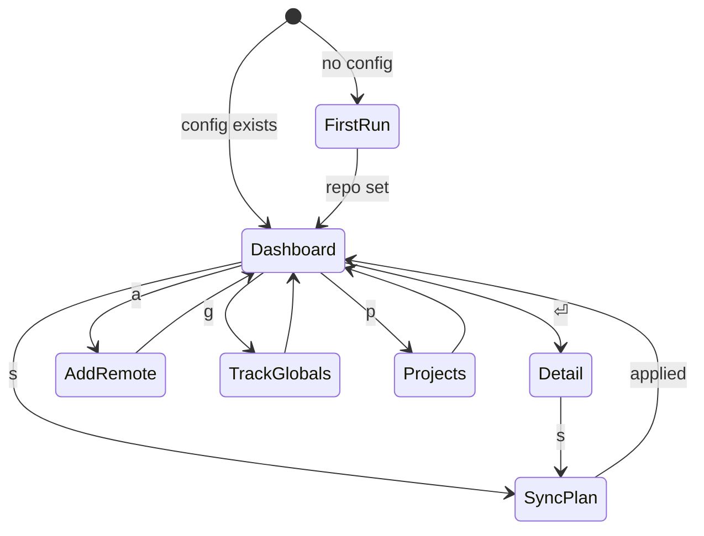

# TUI — screens and interaction design

> **Draft sketch.** Indicative mockups to agree the shape, not final layout. Column math and exact widths get locked against an 80-column target when implemented. The model these screens sit on top of is in [overview.md](overview.md). Stack and layout rules: [ratatui-tui-stack.md](../guides/ratatui-tui-stack.md).

## Legend

Code blocks are monochrome, so state is carried by glyphs. Each has an intended color (the ratatui theme maps them; see [ADR-0002](../adrs/0002-rust-and-ratatui-for-the-tui.md)).

**Sync status** (a skill, or a skill at one destination):

| Glyph | Meaning | Intended color |
|-------|---------|----------------|
| `●` | in sync | green |
| `↑` | your side is newer — repo/local ahead of a destination | yellow |
| `▲` | a source is newer — behind upstream/repo | blue |
| `↕` | differs on both sides (later: opens a diff) | magenta |
| `○` | available, not synced to this destination | dim |
| `✗` | source gone / broken link | red |

**Origin:** `personal` · `vendor:<src>` (the remote it was copied from).
**Destinations:** `G` = global (`~/.agents`, `~/.claude`) · project names (e.g. `web-app`, `api`) · `—` = nowhere yet.
**Selection:** `▸` marks the focused row.

## Navigation



## First run

No config yet → point skilloom at the loom-skills repo. Saved to `~/.config/skilloom/config.toml`.

```text
┌─ skilloom · first run ─────────────────────────────────┐
│                                                        │
│  Point skilloom at your skills repo (loom-skills).     │
│                                                        │
│  Repo path or git URL                                  │
│  ┌──────────────────────────────────────────────────┐ │
│  │ ~/projects/loom-skills                           │ │
│  └──────────────────────────────────────────────────┘ │
│                                                        │
│  Saved to ~/.config/skilloom/config.toml               │
│                                                        │
│              ⏎ continue        esc quit                │
└────────────────────────────────────────────────────────┘
```

## Dashboard (home)

The curated skill set, each with its origin and where it's synced. Top pane is the list; bottom pane is the selected skill's destination map ("which goes where"); footer is the keymap.

```text
┌─ skilloom ─────────────────────────────── global · 12 skills ─┐
│  ST  SKILL             ORIGIN           DESTINATIONS           │
│  ●   commit-helper     personal         G  web-app  api        │
│  ↑   pr-review         personal         G                      │
│▸ ▲   rust-testing      vendor:x/skills  G  api                 │
│  ○   changelog         vendor:y/kit     web-app                │
│  ✗   old-scaffold      vendor:z/dead    —                      │
│                                                               │
├─ rust-testing ────────────────────────────────────────────────┤
│  vendor · github.com/x/skills @ a1b2c3d · synced 2d ago       │
│    ● global            in sync                                 │
│    ▲ project: api      repo is 3 commits ahead → needs sync    │
│    ○ project: web-app  available, not synced                  │
├───────────────────────────────────────────────────────────────┤
│ ↑↓ move  ⏎ detail  a add  g globals  p projects  s sync  ? ·q │
└───────────────────────────────────────────────────────────────┘
```

Callouts:
- The **ST** column is the roll-up status across all of a skill's destinations (worst-case wins, so `▲` beats `●`).
- The **detail pane** is where the per-destination truth lives — this is the "keep track of which ones go where" surface.
- `old-scaffold` with destinations `—` and status `✗` = vendored source is gone and it isn't synced anywhere; a candidate to drop.

## Skill detail

Full destination map + source metadata for one skill; the place you act on a single skill.

```text
┌─ rust-testing ─────────────────────────────────────────┐
│  origin    vendor: github.com/x/skills                 │
│  ref       a1b2c3d   ·   synced 2d ago                 │
│                                                        │
│  destinations                                          │
│    ● global (~/.agents, ~/.claude)   in sync           │
│    ▲ api        repo 3 commits ahead → needs sync      │
│    ○ web-app    available, not synced                  │
│                                                        │
│  space toggle a destination   s sync this skill        │
│  f fetch from remote          x remove       esc back  │
└────────────────────────────────────────────────────────┘
```

## Add a remote skill

skills.sh-style: give a git repo, choose skills, copy into `vendor/`.

```text
┌─ add remote skill ─────────────────────────────────────┐
│  Source (git repo)                                     │
│  ┌──────────────────────────────────────────────────┐ │
│  │ github.com/anthropics/skills                     │ │
│  └──────────────────────────────────────────────────┘ │
│                                                        │
│  Found 4 skills                                        │
│   [x] pdf-filling                                      │
│   [x] slack-gif-creator                                │
│   [ ] mcp-builder                                      │
│   [ ] artifacts-builder                                │
│                                                        │
│  → copies to loom-skills/vendor/<name>/ with source    │
│    metadata (url, ref, synced-at)                      │
│                                                        │
│         space toggle    ⏎ add    esc cancel            │
└────────────────────────────────────────────────────────┘
```

## Track global skills

Import skills already living in `~/.agents` / `~/.claude` up into `personal/`.

```text
┌─ track global skills ──────────────────────────────────┐
│  Found in ~/.agents / ~/.claude, not yet in the repo   │
│   [x] pr-review        ~/.claude/skills/pr-review      │
│   [ ] scratch-notes    ~/.agents/skills/scratch-notes  │
│                                                        │
│  → imports into loom-skills/personal/<name>/           │
│                                                        │
│         space toggle    ⏎ import    esc cancel         │
└────────────────────────────────────────────────────────┘
```

## Projects

Track project folders and see each project's skills. Illustrates curation: a project-only skill that you may *not* want synced up.

```text
┌─ projects ─────────────────────────────────────────────┐
│  ▸ web-app     ~/projects/web-app        4 skills       │
│    api         ~/projects/api            2 skills       │
│                                                        │
│  web-app skills                                        │
│    ● commit-helper   from repo (personal)              │
│    ● changelog       from repo (vendor:y/kit)          │
│    ↑ deploy-notes    local only — not in repo          │
│                                                        │
│  a add project   u untrack   ⏎ manage   esc back       │
└────────────────────────────────────────────────────────┘
```

## Sync plan (confirm before applying)

Sync is explicit: skilloom shows the plan, you confirm. Curation shows up as **skipped** lines.

```text
┌─ sync ─────────────────────────────────────────────────┐
│  Plan — 3 actions                                      │
│   [x] ↓ repo → global    rust-testing   update         │
│   [x] ↓ repo → api       rust-testing   install        │
│   [x] ↑ global → repo    pr-review      update personal│
│                                                        │
│  skipped                                               │
│   · deploy-notes (web-app)   project-only, not tracked │
│                                                        │
│        space toggle line    ⏎ apply    esc cancel      │
└────────────────────────────────────────────────────────┘
```

Applying → progress:

```text
┌─ sync · applying 2 of 3 ───────────────────────────────┐
│  ✓ repo → global   rust-testing   updated              │
│  ▸ repo → api      rust-testing   copying…             │
│  · global → repo   pr-review      queued               │
└────────────────────────────────────────────────────────┘
```

## Empty & error states

Empty (fresh repo, nothing tracked):

```text
┌─ skilloom ─────────────────────── global · 0 skills ─┐
│                                                      │
│   No skills tracked yet.                             │
│                                                      │
│   a  add a remote skill (skills.sh-style git repo)   │
│   g  import skills from ~/.agents / ~/.claude        │
│                                                      │
└──────────────────────────────────────────────────────┘
```

Error (non-fatal, action left unchanged):

```text
┌─ error ────────────────────────────────────────────────┐
│  Couldn't reach github.com/x/skills                    │
│    git: could not resolve host                         │
│  The vendored copy is unchanged. Retry when online.    │
│              r retry        esc dismiss                │
└────────────────────────────────────────────────────────┘
```

## Keymap (dashboard)

| Key | Action |
|-----|--------|
| `↑` `↓` / `k` `j` | move selection |
| `⏎` | open skill detail |
| `a` | add a remote skill |
| `g` | track/import global skills |
| `p` | projects |
| `s` | sync (open the plan) |
| `f` | fetch/refresh status from remotes |
| `?` | help overlay |
| `q` | quit |

*(Later, per [overview.md](overview.md): `/` filter, `t` tag, and a diff view opened from a `↕` row.)*

## Open questions

- **Roll-up vs. per-destination as the primary view** — is the home a list of *skills* (roll-up status, detail pane for destinations, as sketched) or a matrix of skills × destinations? The list keeps the common case readable; a matrix shows everything at once but gets wide fast.
- **Where "add project" and "sync" live** — modal (as sketched) vs. a dedicated pane/tab.
- **Global fan-out visibility** — if the global side uses one canonical `~/.agents/skills` + symlinks, should the UI show `~/.agents` and `~/.claude` separately or as one `global`? (Sketched as one.)

## Related

- [overview.md](overview.md) — the functional model behind these screens
- [ADR-0002](../adrs/0002-rust-and-ratatui-for-the-tui.md) / [ratatui-tui-stack.md](../guides/ratatui-tui-stack.md) — the stack and layout rules
