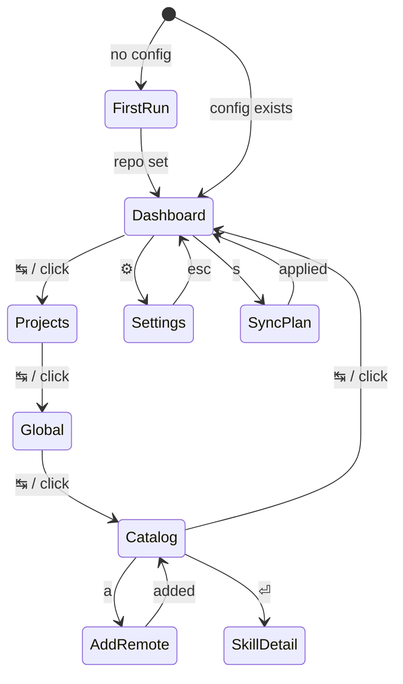

# TUI — screens and interaction design

> **Draft sketch.** Indicative mockups to agree the shape, not final layout — column math and exact widths get locked against the real terminal when implemented. The model these screens sit on is in [overview.md](overview.md); stack and layout rules in [ratatui-tui-stack.md](../guides/ratatui-tui-stack.md).

## Assumptions

- **Large screen.** The layout assumes a roomy terminal (≥ ~100 cols). A tab bar, a persistent left nav, and multi-pane content are the default. Narrow-terminal behavior (collapse the left nav, stack the summary cards) is a later concern — see [Open questions](#open-questions).
- **Mouse and keyboard, first-class.** Like herdr, every navigation affordance is clickable *and* keyable. See [Interaction](#interaction-mouse--keyboard).

## Chrome: the persistent frame

Every screen shares one frame: a **top tab bar** (major areas) with a **settings gear top-right**, a **left nav** scoped to the active tab, the **content view**, and a **footer** of context keys + mouse hints.

```text
┌ TAB BAR: skilloom · [active tab] other tabs ....................... ⚙ ┐
│ LEFT NAV        │  CONTENT — the active tab's page                     │
│ (tab-specific)  │                                                      │
│                 │                                                      │
├ FOOTER: context keys + mouse hints ───────────────────────────────────┤
└───────────────────────────────────────────────────────────────────────┘
```

The four tabs map onto the hub-and-spoke model: **Catalog** is the library (the loom-skills repo), **Global** and **Projects** are the two places skills deploy to, and **Dashboard** is the view across all of it.

| Tab | What it is | Left nav |
|-----|-----------|----------|
| **Dashboard** | Overview: search + summary (updates available, sync roll-up, recent activity) | — (full-width) |
| **Projects** | Your tracked projects; pick one to manage its skills | project list |
| **Global** | Skills deployed to `~/.agents`/`~/.claude`, plus on-disk skills to import | filter sections |
| **Catalog** | The whole loom-skills library (`personal/` + `vendor/`); browse, add remote, deploy | categories / sources |
| **⚙ Settings** | Repo location, agent targets, sync options, about — reached via the gear (top-right) or `,` | settings sections |

## Legend

Code blocks are monochrome, so state is carried by glyphs; each maps to a themed color ([ADR-0002](../adrs/0002-rust-and-ratatui-for-the-tui.md)).

**Sync status** (a skill, or a skill at one destination):

| Glyph | Meaning | Color |
|-------|---------|-------|
| `●` | in sync | green |
| `↑` | your side is newer — repo/local ahead of a destination (or on-disk, not yet in repo) | yellow |
| `▲` | a source is newer — behind upstream/repo | blue |
| `↕` | differs on both sides (later: opens a diff) | magenta |
| `○` | available, not deployed to this destination | dim |
| `✗` | source gone / broken | red |

**Origin:** `personal` · `vendor:<src>`. **Deployed to:** `G` = global · project names · `—` = nowhere. **Selection:** `▸` marks the focused row/nav item.

## Navigation

Tabs cycle with `↹` (or jump with `1`–`4`, or click). Settings (`⚙`/`,`), skill detail (`⏎`), and the sync plan (`s`) open as overlays over any tab and `esc` back.



## First run

No config yet → point skilloom at the loom-skills repo, saved to `~/.config/skilloom/config.toml`. No tabs until this is done.

```text
┌ skilloom · first run ──────────────────────────────────┐
│                                                        │
│  Point skilloom at your skills repo (loom-skills).     │
│                                                        │
│  Repo path or git URL                                  │
│  ┌──────────────────────────────────────────────────┐ │
│  │ ~/projects/loom-skills                           │ │
│  └──────────────────────────────────────────────────┘ │
│                                                        │
│  Saved to ~/.config/skilloom/config.toml               │
│              ⏎ continue        esc quit                │
└────────────────────────────────────────────────────────┘
```

## Dashboard tab

Search + summary cards + recent activity. Full-width (no left nav).

```text
┌ skilloom ─ [ Dashboard ]  Projects   Global   Catalog ──────────────────  ⚙ ┐
│  ⌕ ┌─────────────────────────────────────────────────────────────────────┐ │
│    │ search skills…                                                      │ │
│    └─────────────────────────────────────────────────────────────────────┘ │
│  ┌ Overview ──────────────┐  ┌ Updates available · 3 ─────────────────────┐│
│  │  24 skills             │  │ ▲ rust-testing   vendor:x/skills      3 ↑   ││
│  │  18 ● in sync          │  │ ▲ changelog      vendor:y/kit         1 ↑   ││
│  │   4 ▲ need sync        │  │ ▲ pdf-filling    vendor:anthropic     2 ↑   ││
│  │   2 ✗ issues           │  │       [ sync all ]        [ review ]        ││
│  │  3 projects · global   │  └─────────────────────────────────────────────┘│
│  └────────────────────────┘                                                 │
│  ┌ Recent activity ────────────────────────────────────────────────────────┐│
│  │ 2d  synced rust-testing → global                                         ││
│  │ 2d  imported pr-review from ~/.claude → personal/                        ││
│  │ 5d  added vendor:anthropic/skills (pdf-filling, slack-gif)               ││
│  └──────────────────────────────────────────────────────────────────────────┘│
├ ↹ tab · 1-4 jump   / search   s sync all   , settings   click   ? · q ───────┤
└────────────────────────────────────────────────────────────────────────────────┘
```

- **Search** finds skills across the library and destinations; `/` focuses it.
- **Updates available** = vendored skills whose remote is newer; `[ sync all ]` opens the sync plan pre-filled.
- **Recent activity** is the ledger's log — syncs, imports, adds.

## Projects tab

Left nav = tracked projects; content = the selected project's skills and actions.

```text
┌ skilloom ─ Dashboard   [ Projects ]   Global   Catalog ─────────────────  ⚙ ┐
│ PROJECTS          │ web-app · ~/projects/web-app                            │
│ ▸ web-app         │ ────────────────────────────────────────────────────── │
│   api             │ ST  SKILL           SOURCE             ACTION           │
│   docs-site       │ ●   commit-helper   repo:personal      in sync          │
│                   │ ▲   changelog       repo:vendor y/kit   [ sync ]         │
│ + add project     │ ↑   deploy-notes    project-only        [ push to repo ]│
│                   │ ○   rust-testing    repo (available)    [ install ]      │
│                   │                                                         │
│                   │ [ sync project ]    [ open folder ]                     │
├ ↹ tab   ↑↓ nav   ⏎ detail   space select   s sync   click   , settings  ? q ┤
└────────────────────────────────────────────────────────────────────────────────┘
```

`deploy-notes` lives only in the project (`↑`, "project-only") — curation guardrail: it stays put unless you explicitly `[ push to repo ]`. `rust-testing` is in the repo but not installed here → `[ install ]`.

## Global tab

Left nav = filter sections; content = global skills and their status. `On disk` is the import surface (skills already in `~/.agents`/`~/.claude`, not yet in the repo).

```text
┌ skilloom ─ Dashboard   Projects   [ Global ]   Catalog ─────────────────  ⚙ ┐
│ GLOBAL            │ Global skills → ~/.agents · ~/.claude                   │
│ ▸ Deployed · 8    │ ────────────────────────────────────────────────────── │
│   Available · 12  │ ST  SKILL           SOURCE             ACTION           │
│   On disk · 2     │ ●   commit-helper   repo:personal      in sync          │
│                   │ ▲   rust-testing    repo:vendor x       [ sync ]         │
│                   │ ↑   scratch-notes   on disk only        [ import ]       │
│                   │                                                         │
│                   │ [ sync global ]                                         │
├ ↹ tab   ↑↓ nav   space select   s sync   i import   click   , settings  ? q ┤
└────────────────────────────────────────────────────────────────────────────────┘
```

## Catalog tab

The whole library. Left nav = categories (`All`/`Personal`/`Vendor`) and, under a divider, by-source groups. Content = the skills, with a **Deployed to** column showing where each lands. `+ add remote skill` lives here.

```text
┌ skilloom ─ Dashboard   Projects   Global   [ Catalog ] ─────────────────  ⚙ ┐
│ CATALOG           │ All skills in loom-skills                    ⌕ filter   │
│ ▸ All · 24        │ ────────────────────────────────────────────────────── │
│   Personal · 9    │ ST  SKILL           ORIGIN             DEPLOYED TO       │
│   Vendor · 15     │ ●   commit-helper   personal           G  web-app  api  │
│ ─ sources         │ ▲   rust-testing    vendor:x/skills    G  api           │
│   x/skills        │ ●   pdf-filling     vendor:anthropic   —                │
│   y/kit           │ ○   slack-gif       vendor:anthropic   —                │
│   anthropic/skills│                                                         │
│                   │ + add remote skill                                      │
│                   │ [ fetch updates ]   [ deploy → ]                        │
├ ↹ tab   ↑↓ nav   ⏎ detail   a add remote   f fetch   click   , settings  ? q┤
└────────────────────────────────────────────────────────────────────────────────┘
```

## Settings (⚙)

Reached via the top-right gear or `,`. Left nav = settings sections; `esc` returns to the last tab.

```text
┌ skilloom ─ Dashboard   Projects   Global   Catalog ─────────────────────  [⚙]┐
│ SETTINGS          │ skilloom settings                                       │
│ ▸ Repo            │ ────────────────────────────────────────────────────── │
│   Agent targets   │ loom-skills repo                                        │
│   Sync            │   path    ~/projects/loom-skills                        │
│   About           │   remote  git@github.com:mikevalstar/loom-skills.git    │
│                   │                                                         │
│                   │ locations                                              │
│                   │   config  ~/.config/skilloom/config.toml                │
│                   │   state   ~/.local/state/skilloom/                      │
│                   │                                                         │
│                   │ [ change repo ]   [ open config ]                       │
├ esc close settings   ↑↓ nav   ⏎ edit   click   ? help   q quit ─────────────┤
└────────────────────────────────────────────────────────────────────────────────┘
```

- **Agent targets** — which agent dirs skilloom manages (`~/.claude`, `~/.agents`, `~/.cursor`, …) and how the global side fans out (one canonical `~/.agents/skills` + symlinks vs. a copy into each — the open mechanism question from [overview.md](overview.md)).
- **Sync** — defaults like confirm-before-apply, auto-fetch on open.

## Overlays

Reachable from any tab; float centered over the frame.

**Skill detail** (`⏎` on a skill) — the per-destination truth for one skill:

```text
┌ rust-testing ──────────────────────────────────────────────┐
│ origin   vendor: github.com/x/skills                        │
│ ref      a1b2c3d  ·  synced 2d ago                          │
│                                                             │
│ deployed to                                                 │
│   ● global (~/.agents, ~/.claude)   in sync                 │
│   ▲ api        repo 3 commits ahead → needs sync            │
│   ○ web-app    available, not deployed                      │
│                                                             │
│ space toggle a destination   s sync this skill              │
│ f fetch from remote   x remove   esc close                  │
└─────────────────────────────────────────────────────────────┘
```

**Add remote skill** (`a` in Catalog):

```text
┌ add remote skill ──────────────────────────────────────────┐
│ Source (git repo)                                           │
│ ┌─────────────────────────────────────────────────────────┐│
│ │ github.com/anthropics/skills                            ││
│ └─────────────────────────────────────────────────────────┘│
│ Found 4 skills                                              │
│  [x] pdf-filling        [ ] mcp-builder                     │
│  [x] slack-gif-creator  [ ] artifacts-builder               │
│                                                             │
│ → copies to loom-skills/vendor/<name>/ with source metadata │
│         space toggle    ⏎ add    esc cancel                 │
└─────────────────────────────────────────────────────────────┘
```

**Sync plan** (`s`) — explicit; curation shows as skipped lines — then progress:

```text
┌ sync ──────────────────────────────────────────────────────┐    ┌ sync · applying 2 of 3 ───────────────────┐
│ Plan · 3 actions                                            │    │ ✓ repo → global   rust-testing  updated    │
│  [x] ↓ repo → global   rust-testing   update                │    │ ▸ repo → api      rust-testing  copying…   │
│  [x] ↓ repo → api      rust-testing   install               │    │ · global → repo   pr-review     queued     │
│  [x] ↑ global → repo   pr-review      update personal       │    └────────────────────────────────────────────┘
│ skipped                                                     │
│  · deploy-notes (web-app)   project-only, not tracked       │
│        space toggle line    ⏎ apply    esc cancel           │
└─────────────────────────────────────────────────────────────┘
```

## Empty & error states

Empty (fresh repo, nothing tracked) — the Dashboard points at the two ways in:

```text
┌ skilloom ─ [ Dashboard ]  Projects   Global   Catalog ──────────────────  ⚙ ┐
│                                                                             │
│   No skills tracked yet.                                                    │
│                                                                             │
│   Catalog › + add remote skill   — pull a skills.sh-style repo into vendor/ │
│   Global  › import               — adopt skills already in ~/.agents/.claude│
│                                                                             │
├ ↹ tab   , settings   ? help   q quit ───────────────────────────────────────┤
└────────────────────────────────────────────────────────────────────────────────┘
```

Error (non-fatal; the action left things unchanged):

```text
┌ error ─────────────────────────────────────────────────────┐
│ Couldn't reach github.com/x/skills                          │
│   git: could not resolve host                               │
│ The vendored copy is unchanged. Retry when online.          │
│              r retry        esc dismiss                     │
└─────────────────────────────────────────────────────────────┘
```

## Interaction: mouse & keyboard

Both are first-class (crossterm mouse capture; we hit-test regions).

**Clickable:** top tabs, the gear, left-nav items, table rows (click = select, double-click = open detail), inline buttons (`[ sync ]`, `[ install ]`, `[ push to repo ]`, `+ add remote skill`). **Scroll wheel** scrolls the focused list/table.

**Global keys**

| Key | Action |
|-----|--------|
| `↹` / `⇧↹` | next / previous tab |
| `1` `2` `3` `4` | jump to Dashboard / Projects / Global / Catalog |
| `,` or `⚙` click | open Settings |
| `/` | focus search (Dashboard) / filter the current list |
| `s` | open the sync plan |
| `f` | fetch/refresh status from remotes |
| `?` | help overlay |
| `q` | quit · `esc` close overlay / back |

**Context keys** (shown in each tab's footer): `↑↓`/`jk` nav · `⏎` open/detail · `space` select · `a` add remote (Catalog) · `i` import (Global) · `+` add project (Projects).

## Open questions

- **Narrow terminals** — collapse the left nav to icons / a drawer and stack the Dashboard cards below some width; deferred, but the layout should degrade rather than break.
- **Deployed-to overflow** — when a skill is in many projects, the `DEPLOYED TO` column needs truncation (`G web-app +3`).
- **Settings: page vs. overlay** — sketched as a page (tab-bar stays, gear highlighted). Could be a modal instead.
- **Search scope** — skills only, or also projects/sources/activity (command-palette style)?
- **Global fan-out mechanism** — canonical `~/.agents/skills` + symlinks vs. copy into each agent dir (configured under Settings › Agent targets); still open in [overview.md](overview.md).

## Related

- [overview.md](overview.md) — the functional model behind these screens
- [ADR-0002](../adrs/0002-rust-and-ratatui-for-the-tui.md) / [ratatui-tui-stack.md](../guides/ratatui-tui-stack.md) — the stack and layout rules
